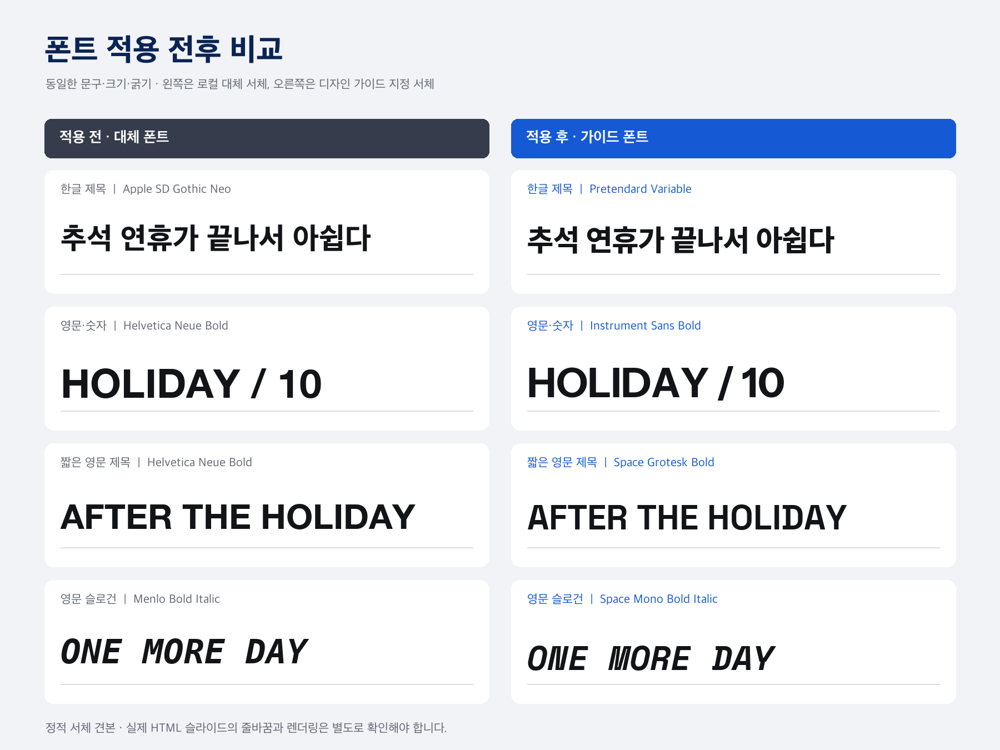

# 폰트 적용 전후 견본

이 이미지는 추석 발표자료의 한글 제목과 프로필의 영문 서체 역할을 같은 문구, 크기, 굵기로 그린 정적 견본입니다. 왼쪽은 이 macOS 환경의 대체 서체, 오른쪽은 공식 배포처의 원본 서체입니다. 실제 HTML 슬라이드의 스크린샷은 아니므로 줄바꿈과 브라우저 렌더링은 별도로 확인해야 합니다.

| 역할 | 적용 전 | 적용 후 | 적용 후 원본 |
| --- | --- | --- | --- |
| 한글 제목 | Apple SD Gothic Neo ExtraBold | Pretendard Variable 800 | [Pretendard v1.3.9](https://github.com/orioncactus/pretendard/releases/tag/v1.3.9) |
| 영문·숫자 | Helvetica Neue Bold | Instrument Sans Bold | [Instrument Sans](https://github.com/Instrument/instrument-sans/tree/7fa22308a3d0c94ee2b3cd537a1196b65db34a3e) |
| 짧은 영문 제목 | Helvetica Neue Bold | Space Grotesk Bold | [Space Grotesk](https://github.com/floriankarsten/space-grotesk/tree/03507d024a01282884232081fc6011c09ff4e849) |
| 영문 슬로건 | Menlo Bold Italic | Space Mono Bold Italic | [Space Mono](https://github.com/googlefonts/spacemono/tree/329858c2c4dbd3476f972a4ae00624b018cf4b81) |

폰트 파일은 저장소에 포함하지 않았습니다. 각 서체의 라이선스 및 실제 슬라이드 생성 시 고지 절차는 [FONTS.md](../plugins/depromeet-plugin/skills/create-slides/profiles/depromeet_19/FONTS.md)에 정리했습니다.
