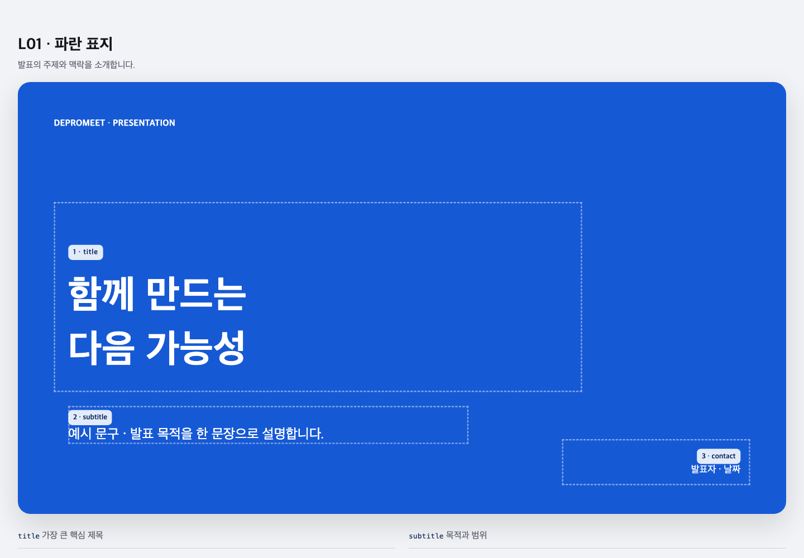
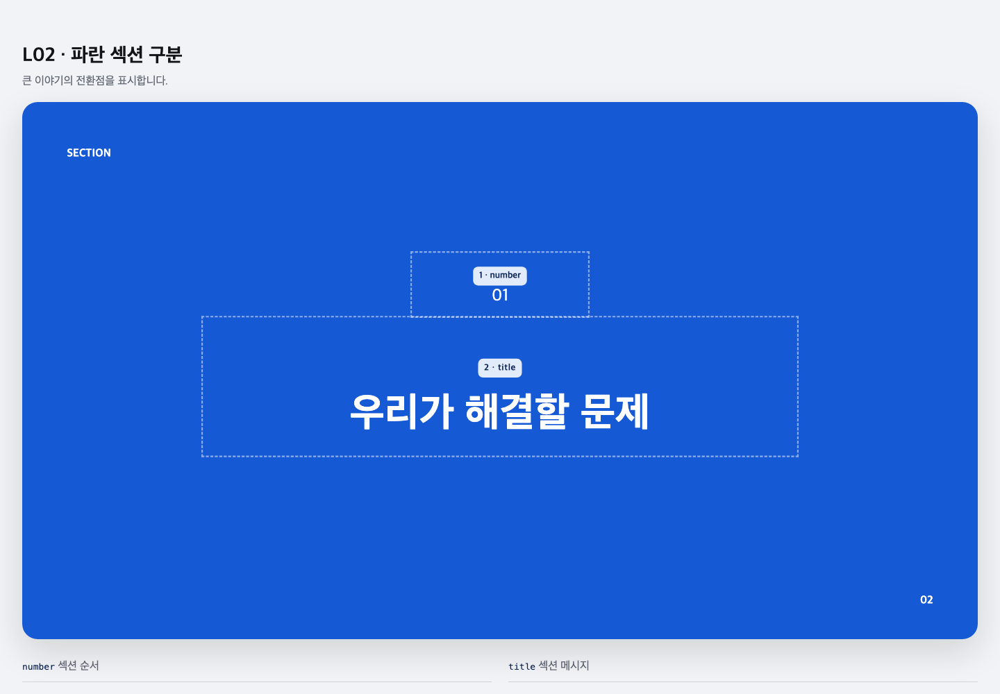
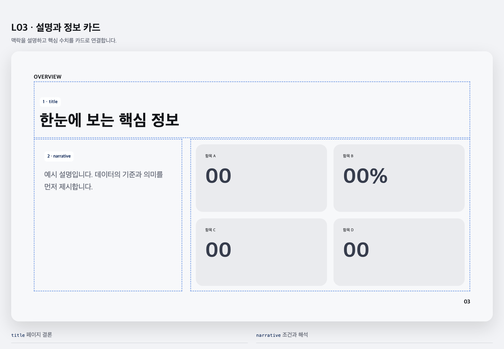
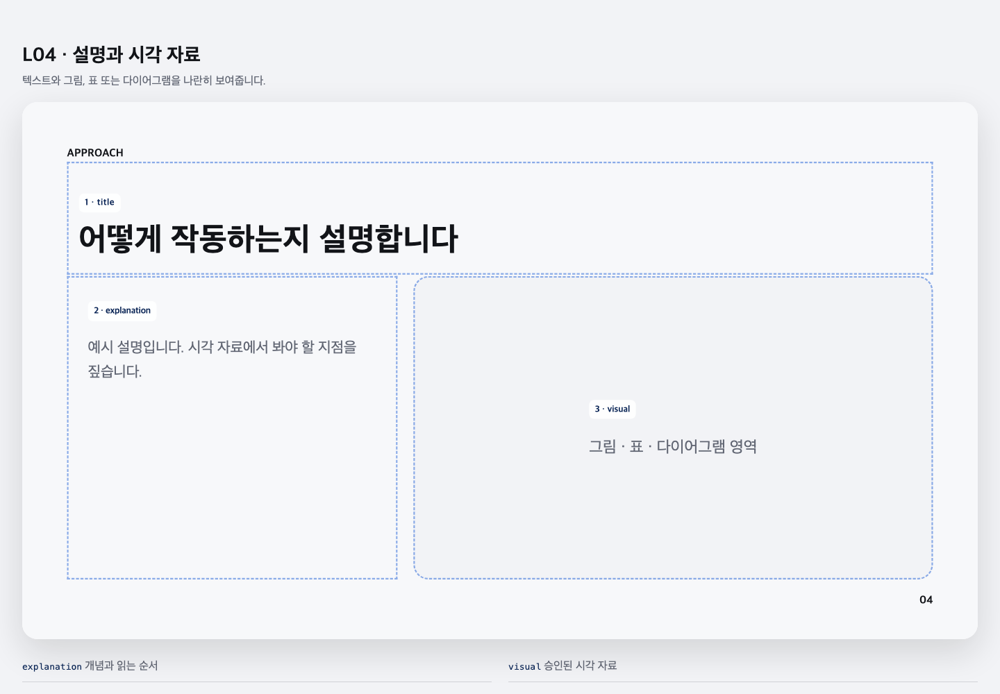
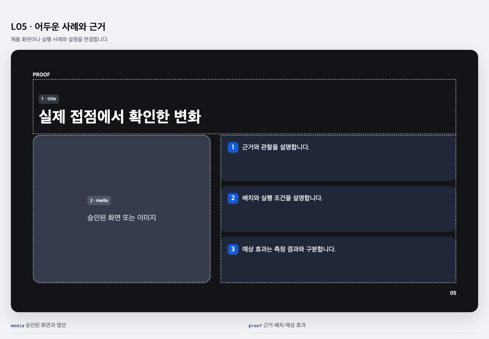

# depromeet_19 레이아웃 미리보기

`depromeet_19` 프로필의 [실행 가능한 HTML 스켈레톤](../../../plugins/depromeet-plugin/skills/create-slides/profiles/depromeet_19/layout-skeleton.html)에서 각 레이아웃을 분리해 Chrome headless로 1440×1000 화면에 렌더링했습니다. 점선과 문구·숫자는 레이아웃 검토용 예시이며 최종 발표 콘텐츠가 아닙니다. 제공된 PDF에는 폰트 파일이 없으므로, 글꼴이 설치되지 않은 환경에서는 CSS의 대체 글꼴로 보입니다.

## L01 · 표지

## L02 · 섹션 구분

## L03 · 정보 카드

## L04 · 설명과 시각 자료

## L05 · 사례와 근거

