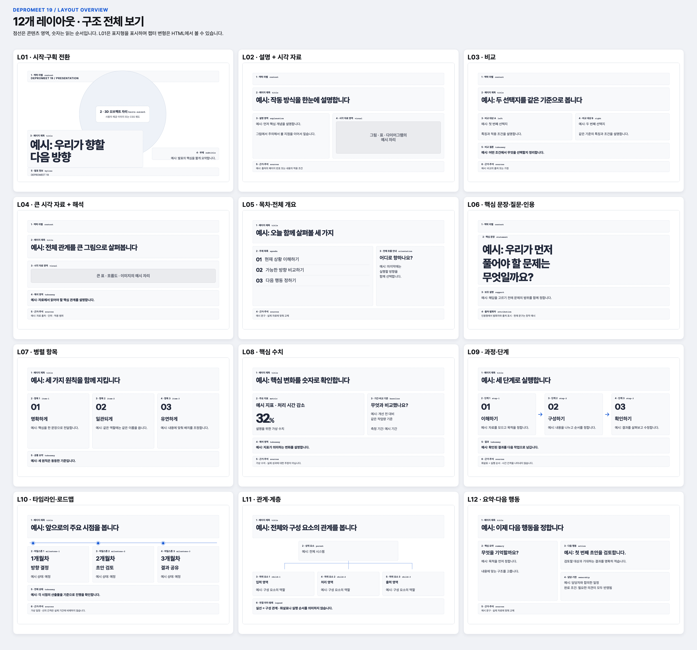
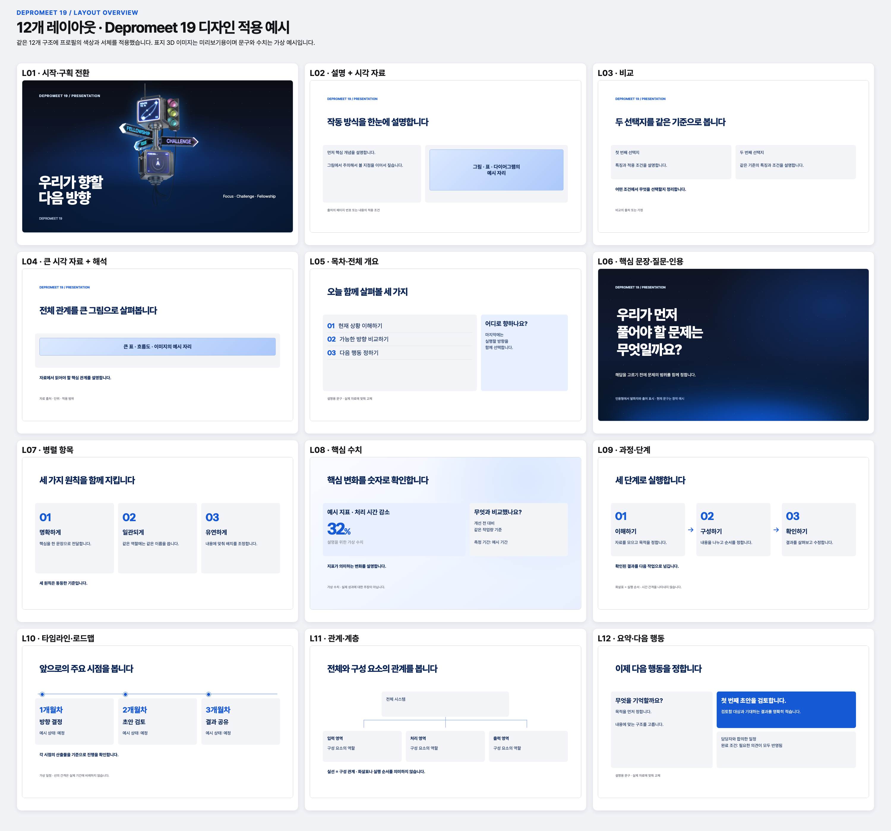

# depromeet_19 slide profile

This is the bundled visual profile for Depromeet 19th-generation presentations.
It adapts the supplied 19th-generation design-guide PDFs for browser-based
slides. The source PDFs and font binaries are not distributed with this skill.
The guide defines colors and type styles; slide geometry below is an adaptation
for this skill, not a rule quoted from the guide. The 12 layout families adapt
the earlier ziweek slide-layouts-12 structural gallery. That repository is not
a runtime dependency; the profile bundles its own Depromeet-styled specimens.

## Files and ownership

- [style.css](style.css) is the source of truth for color values, font stacks,
  stage geometry, spacing, component appearance, and review-only styling.
- [layout-skeleton.html](layout-skeleton.html) is the browser-visible set of
  layout specimens and region names. It loads `style.css` beside itself.
- [layout-overview.png](layout-overview.png) shows all 12 structural families
  together; [design-overview.png](design-overview.png) shows the same families
  with this profile's visual design and illustrative copy.
- This file defines when to use those values and how to adapt the source guide
  to a slide. Do not add profile-specific defaults to the common workflow.
- [FONTS.md](FONTS.md) identifies the original font distributions and the
  required license, acquisition, and fallback handling for each deck.

The overview images are quick references, not page plans or final slide assets.
Their wording and numbers are illustrative. Use the HTML skeleton to inspect
individual regions and confirm the selected layouts for each presentation.

### Layout structure

### Depromeet 19 design example

When preparing a deck, copy both the skeleton and stylesheet into its output
directory. Keep their relative link working. Select only the layouts needed,
and replace illustrative copy before review. The confirmed deck-specific
`style-profile.md` records this profile name, the chosen modes and layouts, and
any approved changes. For a self-contained final `index.html`, embed the
required rules from `style.css`; otherwise keep a local stylesheet in `assets/`.

## Color and slide modes

`style.css` contains the complete color entries visible in the supplied color
PDF: default black/white, seven blues, eleven cool grays, four transparency
styles, and three gradients. The PDF heading says 36 registered styles, while
its visible tables enumerate 27. Do not invent the other nine.

- Use `--blue-500` for Depromeet identity and selected emphasis.
- Use `--blue-800` or `--gray-950` for strong text and dark backgrounds.
- Use white and `--gray-50`/`--gray-100` for light pages; use `--gray-200`
  for quiet cards and `--gray-700` for secondary text.
- Blue pages introduce or divide sections. Light pages carry explanations,
  diagrams, and numbers. Dark pages can carry screenshots or evidence.
- The three guide gradients are available as tokens. Use one only when it
  supports the page hierarchy and keeps text readable; a gradient is not
  required on every cover.

Use the palette roles in the CSS instead of pasting hex values into a deck.
Check contrast in the rendered deck, especially for small labels and muted text.

## Typography

- Korean text, numbers within Korean text, and mixed Korean/English lines use
  Pretendard. This follows the Pretendard guide's explicit mixed-line rule.
- English-only text or numbers-only text use Instrument Sans via `.latin-only`.
- The Space Grotesk / Space Mono guide shows display and slogan specimens.
  This slide adaptation offers `.display-latin` for a short English display
  and `.slogan-latin` for a short slogan. Do not apply them to Korean copy.
- The supplied PDFs do not include usable font files. Follow [FONTS.md](FONTS.md)
  to obtain the fonts used by this deck, include their license notices, and
  load them locally. The CSS fallback stack remains available when acquisition
  or loading fails; disclose that fallback to the user and in the final handoff.
  Verify the rendered font, because a fallback changes line wrapping.

The PDF type sizes describe a design-system specimen, not a 1920×1080 slide.
The specimen CSS scales important roles for viewing at presentation distance:
opening title 106 px, standard title 64 px, body about 30 px, and region labels
about 22 px.
Keep Korean line breaks at meaningful phrases. Test the actual deck at full
presentation size and a smaller desktop viewport.

## Geometry and candidate layouts

The profile uses a 1920×1080, 16:9 stage. Start with a 90 px stage margin,
24–30 px region gaps, and broad text/image regions. These measurements are
slide-specific choices. Change them in this profile when updating its look.

| Layout ID | Use | Main regions |
| --- | --- | --- |
| `L01` | Opening or section divider | context, title, subtitle, byline |
| `L02` | Explanation with visual | context, title, explanation, visual, sources |
| `L03` | Comparison | context, title, left, right, takeaway, sources |
| `L04` | Large visual with interpretation | context, title, visual, takeaway, sources |
| `L05` | Agenda or overview | title, agenda, orientation, sources |
| `L06` | Statement, question, or quotation | context, statement, support, attribution |
| `L07` | Parallel items or information cards | title, item-1 through item-3, takeaway |
| `L08` | Key metric | title, metric, baseline, takeaway, sources |
| `L09` | Process or steps | title, step-1 through step-3, takeaway, sources |
| `L10` | Timeline or roadmap | title, milestone-1 through milestone-3, takeaway, sources |
| `L11` | Relationship or hierarchy | title, parent, child-1 through child-3, legend |
| `L12` | Summary and next action | title, summary, action, ownership, sources |

The former five specimens map to these families: cover and divider use `L01`,
information cards use `L07` or `L08`, explanation with visual uses `L02`, and
evidence or example uses `L04` or `L07`. These are starting points; do not force
content into a mismatched family. Use only layouts needed for the current
narrative. Preserve the region names and IDs in the confirmed skeleton and page
plan. Adapt proportions when real content needs room; review a material
geometry change before final HTML.

## Content and assets

- Preserve source conditions, dates, units, denominators, and uncertainty.
- Rebuild a chart only from verified values and label its units.
- Use neutral media placeholders until the deck has authorized assets.
- Keep source images at a readable aspect ratio and add meaningful alt text.
- Do not use source-guide screenshots, logos, or private material as deck assets
  merely because they were supplied for style review.
- Use no motion by default; any added motion must respect reduced motion.
